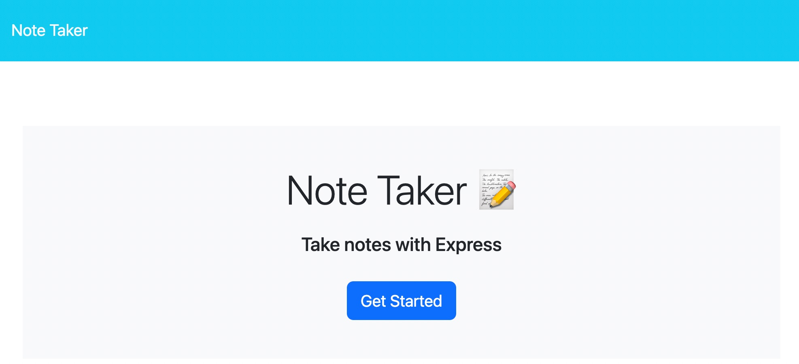
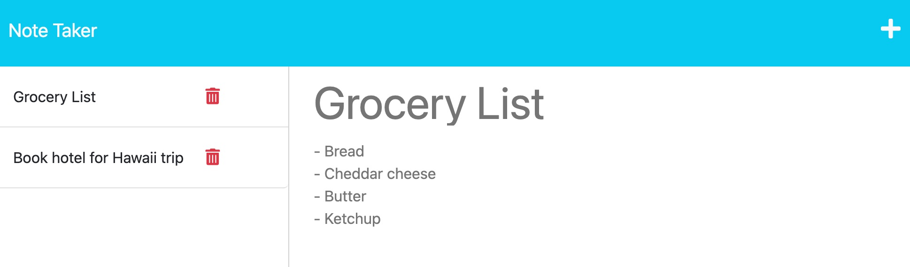

# Note Taker Application

## Description

This application allows a user to store and delete notes. I built it to enable people to keep track of any information they need to refer to later, and then to delete the information once it is no longer needed. For example, a user could use it as a to-do list, deleting each task once it is completed.

## Table of Contents

- [Installation](#installation)
- [Usage](#usage)
- [Credits](#credits)
- [License](#license)

## Installation

This application uses the `Express` framework for API requests, the `UUID` package to randomly generate IDs for the notes in the database, and the `dotenv` package to manage environmental variables. To install these packages, clone the repo, `cd` into it, then run the command `npm i`.

## Usage

Navigate to the [Note Taker App](https://vast-depths-77916.herokuapp.com/) and click "Get Started."

- To save a note, enter the title where it says "Note Title," enter the text where it says "Note Text," and then click the save icon in the top-right corner (Note: The icon will not appear until you have entered a title and text)
- To view a saved note, click on the note in the list on the left
- To delete a saved note, click on the trash can icon next to the note in the list on the left
- To add a new note while viewing a saved note, click the plus sign icon at the top-right

## Credits

The code in the `public` folder was provided by the Berkeley Coding Boot Camp.

The following packages are used in the application:
- [Express](https://expressjs.com/)
- [UUID](https://www.npmjs.com/package/uuid)
- [dotenv](https://www.npmjs.com/package/dotenv)

## License

MIT License